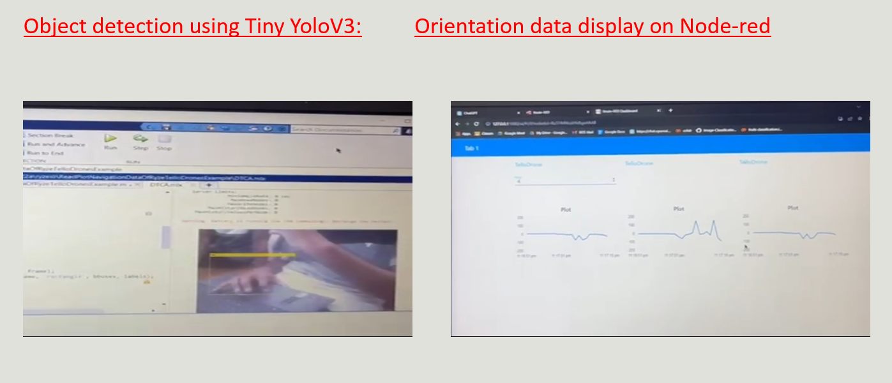
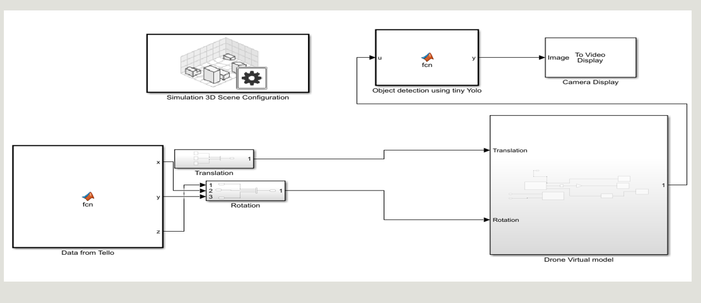
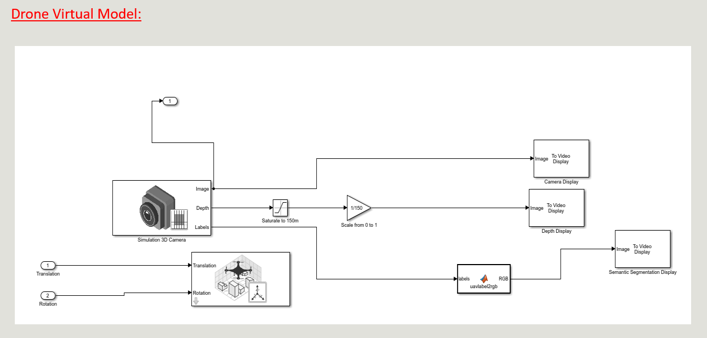
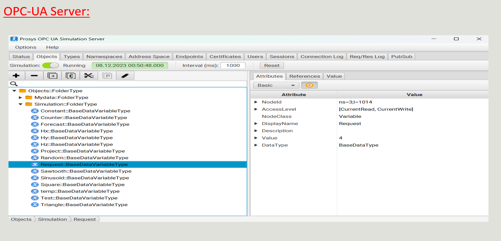
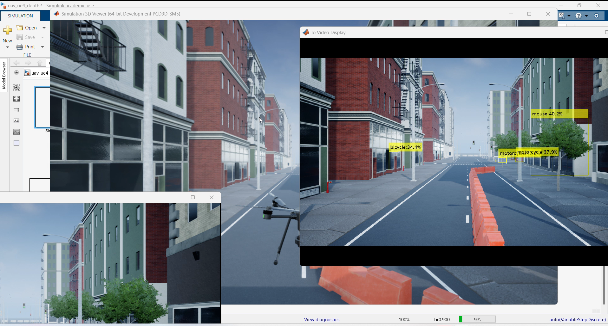

# The Digital Twin of a Drone

## Description

This comprehensive project integrates control of a Tello mini-drone with MATLAB, incorporating advanced features such as object detection using Tiny YOLOv4 models in Simulink. The project involves collecting drone orientation data using MATLAB, preprocessing it by extracting time and frequency domain features, and training one-class SVM, Isolation Forest, and deep learning autoencoder models for anomaly detection during drone flight. Unexpected behavior triggers anomaly indications sent from MATLAB to an OPC UA server. Node-RED, acting as another client to the server, facilitates visualization of anomaly indications. The project also includes displaying orientation data from MATLAB to Node-RED.

Furthermore, a Tiny YOLOv4 model detects open objects in the drone's video feed, performs bounding box detection, and displays the results in MATLAB. The project enables drone control by typing numbers 1 to 5 in Node-RED, with each number representing different functionalities such as object detection, orientation data display, anomaly detection, takeoff, land, and more.

## Prerequisites

- MATLAB software installed.
- Tello mini-drone connected to the MATLAB environment.
- Basic knowledge of MATLAB programming and control systems.
- Familiarity with Simulink for system modeling and simulation.
- Understanding of OPC UA communication and implementation.

## Installation

1. Install MATLAB from the MathWorks website.
2. Connect the Tello mini-drone to MATLAB using the appropriate communication protocols.
3. Set up the required toolboxes for advanced Simulink modeling and AI/ML implementation.
4. Ensure a stable network connection for OPC UA communication.

## Project Tasks

### Tello Mini-Drone Control

- Implement basic controls for the Tello mini-drone (takeoff, landing, movements, right, left, up, down).
- Collect height and orientation data from the drone for analysis.

### Anomaly Detection and Control

- Collect drone orientation data using MATLAB.
- Preprocess data by extracting time and frequency domain features.
- Train one-class SVM, Isolation Forest, and deep learning autoencoder models for anomaly detection during drone flight.
- Indicate anomalies in MATLAB and send indications to OPC UA server as a client.
- Connect from OPC UA to Node-RED for visualization of anomaly indications.
- Display orientation data in Node-RED.

### Object Detection with Tiny YOLOv4 Model in Simulink

- Integrate Tiny YOLOv4 model for object detection in the Simulink environment.
- Implement object detection, bounding box, and visualization in MATLAB.

### AI/ML Integration and Data Analysis

- Apply AI/ML techniques for advanced data analysis and decision-making processes.
- Use data from the drone and the Digital Twin for predictive analysis and control optimization.

### Secure Data Flow with OPC UA and WiFi Communication

- Implement secure and reliable data flow protocols using OPC UA and WiFi communication.
- Monitor data transfer for any potential security breaches or reliability issues.

## Media

#### Simulink Model Diagram

#### Drone Model Diagram

#### OPC UA Communication Setup

#### Project Demonstration Video

